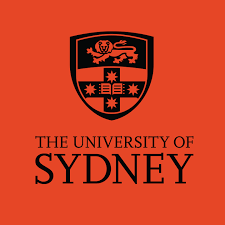

I am currently a Ph.D. student in the Department of Computing at The Hong Kong Polytechnic University (PolyU), under the supervision of Prof. Qing Li and Prof. Wenqi Fan. Before joining the PolyU, I received my M.S. in Information Technology from The University of Sydney (USYD) in 2023, and my B.S. in Computer Science from The University of New South Wales (UNSW) in 2021. My research interest covers Recommender Systems and Graph Neural Networks (GNNs).

## Research Interest 

+ Recommender Systems (RecSys)
+ Graph Neural Networks (GNNs)

## Education

+  &nbsp;&nbsp;&nbsp;PhD student in Computing | <small>2023.09 - Now</small>
 &nbsp;&nbsp;&nbsp;The Hong Kong Polytechnic University
 &nbsp;&nbsp;&nbsp;Advisor: [Prof. Wenqi Fan](https://www.polyu.edu.hk/en/comp/people/academic-staff/dr-fan-wenqi/) and [Prof. Qing Li](https://www.polyu.edu.hk/en/comp/people/academic-staff/prof-li-qing/)

+  &nbsp;&nbsp;&nbsp;MSc in Information Technology | <small>2022 - 2023</small>
 &nbsp;&nbsp;&nbsp;The University of Sydney

+  &nbsp;&nbsp;&nbsp;BSc in Computer Science | <small>2019 - 2021</small>
 &nbsp;&nbsp;&nbsp;The University of New South Wales